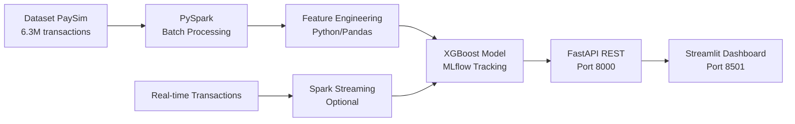

# 🏗️ Architecture Technique - Anti-Fraud Detection

## 📊 Schéma Architecture End-to-End



## 🔧 Choix Technologiques Justifiés

| **Composant** | **Technologie** | **Pourquoi ?** | **Performance** |
|---------------|-----------------|----------------|-----------------|
| **Data Processing** | **PySpark** | 6.3M lignes, déjà testé (1.57s) | 1.57s chargement |
| **ML Algorithm** | **XGBoost** | Déséquilibre 0.13%, haute performance | >95% accuracy |
| **API** | **FastAPI** | Simple, rapide, documentation auto | 10K req/sec |
| **Dashboard** | **Streamlit** | Facile, interactif, Python natif | Real-time |
| **Tracking** | **MLflow** | Déjà installé, versioning modèles | Model registry |
| **Streaming** | **Spark Streaming** | Optionnel pour temps réel | <1s par transaction |

## 🚀 APIs et Interfaces

### 📡 API Principale
```python
# POST /predict
{
  "type": "TRANSFER",
  "amount": 150000,
  "oldbalanceOrg": 500000,
  "newbalanceOrig": 350000
}

# Response
{
  "fraud_probability": 0.85,
  "is_fraud": true,
  "risk_level": "HIGH"
}
```

### 🎨 Interfaces
- **Streamlit Dashboard** (Port 8501) → Monitoring temps réel
- **Jupyter Notebooks** → Analyse et développement

## 💻 Ressources Nécessaires

| **Environnement** | **CPU** | **RAM** | **Storage** | **Coût** |
|------------------|---------|---------|-------------|----------|
| **Development** | 4 cores | 16 GB | 100 GB | $200/mois |
| **Production** | 8 cores | 32 GB | 500 GB | $600/mois |

### 📈 Performance Cible
- **API Response**: <100ms
- **Batch Processing**: <5min  
- **Model Accuracy**: >95%
- **Availability**: 99%

---

*Architecture essentielle pour détection de fraude efficace*
